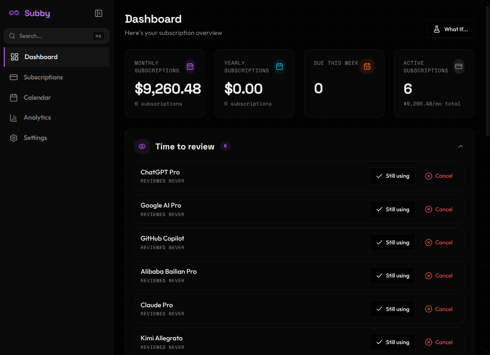
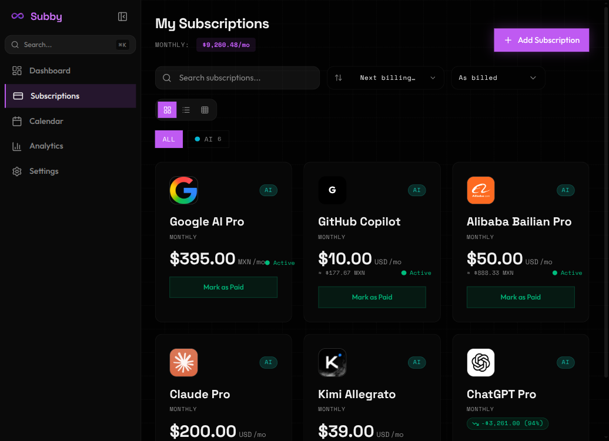
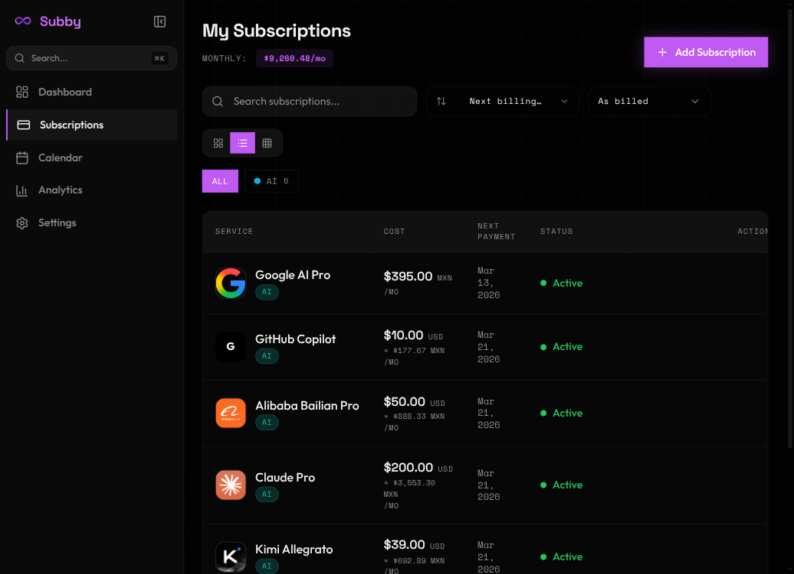

<p align="center">
  
</p>

<h1 align="center">Kessai</h1>

<p align="center">
  <strong>Know where your money flows.</strong>
  <br />
  A local-first subscription tracker. No cloud. No accounts. Just you and your data.
</p>

<p align="center">
  
  
  
  
</p>

<br />

<p align="center">
  
</p>

---

## Features

- **Dashboard** -- Stats, category breakdown, spending trends, budget tracking, price change alerts
- **Subscriptions** -- Grid, list, and bento views. Search, sort, filter by category or tags. Pin favorites
- **Analytics** -- Monthly spending charts, year summaries, spending velocity, category breakdowns
- **Calendar** -- Visual payment schedule. Mark as paid or skip
- **Global Search** -- `Cmd+K` to find anything
- **Multi-Currency** -- 10 currencies with live conversion and cost normalization (daily/weekly/monthly/yearly)
- **Smart Reminders** -- Notifications 1-30 days before renewal. System tray badge
- **Lifecycle Tracking** -- Trials, cancellations with reasons, review nudges for unused subs
- **Data Portability** -- JSON export/import, CSV/bank statement import, diagnostic logs
- **Web + CLI + MCP** -- Browser mode, terminal CLI, AI assistant integration
- **Dark/Light Themes** -- Glassmorphic UI with keyboard shortcuts throughout

---

## Screenshots

<p align="center">
  
  
</p>

<p align="center">
  <em>Grid and list views with category badges, multi-currency conversion, and price change indicators</em>
</p>

---

## Install

### Recommended: Download a Prebuilt Release

Most users should install a prebuilt binary from [Releases](https://github.com/Artificial-Source-Foundation/Kessai/releases). You do **not** need Rust for this.

| Platform          | What to download | Install                                                     |
| ----------------- | ---------------- | ----------------------------------------------------------- |
| **Ubuntu/Debian** | `.deb`           | `sudo dpkg -i kessai_*.deb`                                 |
| **Fedora/RHEL**   | `.rpm`           | `sudo rpm -i kessai-*.rpm`                                  |
| **Any Linux**     | `.AppImage`      | `chmod +x Kessai-*.AppImage && ./Kessai-*.AppImage`         |
| **macOS**         | `.dmg`           | Open the disk image, then drag `Kessai.app` to Applications |
| **Windows**       | `.exe`           | Run the installer                                           |

Example Linux flow after downloading a release asset:

```bash
cd ~/Downloads
sudo dpkg -i kessai_*.deb
```

If `dpkg` reports missing dependencies, run:

```bash
sudo apt-get install -f
```

### Build from Source (Developers)

Building from source is slower because it compiles the Rust backend and Tauri app.

Prerequisites:

- Node.js 22+
- pnpm 10+
- Rust stable toolchain
- Tauri system dependencies for your OS

Ubuntu/Debian system packages:

```bash
sudo apt-get update
sudo apt-get install -y libwebkit2gtk-4.1-dev libgtk-3-dev libayatana-appindicator3-dev librsvg2-dev patchelf
```

Build:

```bash
git clone https://github.com/Artificial-Source-Foundation/Kessai.git
cd Kessai
pnpm install --reporter=silent
pnpm tauri build
```

For local development instead of a production build:

```bash
pnpm tauri dev
```

---

## CLI & MCP

Prebuilt `kessai-mcp` binaries are also attached to each [Release](https://github.com/Artificial-Source-Foundation/Kessai/releases):

| Platform                  | What to download                                       | Run              |
| ------------------------- | ------------------------------------------------------ | ---------------- |
| **Linux**                 | `kessai-mcp-<version>-x86_64-unknown-linux-gnu.tar.gz` | `./kessai-mcp`   |
| **macOS (Intel)**         | `kessai-mcp-<version>-x86_64-apple-darwin.tar.gz`      | `./kessai-mcp`   |
| **macOS (Apple Silicon)** | `kessai-mcp-<version>-aarch64-apple-darwin.tar.gz`     | `./kessai-mcp`   |
| **Windows**               | `kessai-mcp-<version>-x86_64-pc-windows-msvc.zip`      | `kessai-mcp.exe` |

Build from source if you prefer:

```bash
cargo build --release -p kessai-mcp

kessai-mcp list                        # List subscriptions
kessai-mcp add "Netflix" 15.99 monthly 2026-04-01
kessai-mcp stats                       # Dashboard stats
kessai-mcp upcoming --days 14          # Upcoming payments
```

**Web mode:** `cargo run -p kessai-web -- --port 3000` -- same database, browser access.

**MCP:** AI assistant integration with 10 tools and 5 resources. See [MCP Setup Guide](docs/guides/mcp-setup.md).

---

## Development

```bash
pnpm tauri dev           # Start dev app
pnpm check               # Lint + typecheck + format
pnpm test:run            # 517 frontend tests
cargo test --workspace   # 22 Rust tests
```

**Stack:** Tauri 2 (Rust) + React 19 + TypeScript + Vite 7 + Tailwind CSS 4 + shadcn/ui + Zustand + SQLite + Recharts

**Structure:**

```
src/           React frontend (components, pages, stores, hooks, types)
src-tauri/     Rust backend + Tauri commands
crates/        kessai-core (SQLite + business logic), kessai-mcp (CLI + MCP server)
e2e/           Playwright E2E tests
```

---

## Data & Privacy

All data stays on your device. Plain SQLite you can inspect, backup, or migrate.

| Platform | Location                                        |
| -------- | ----------------------------------------------- |
| Linux    | `~/.local/share/com.asf.kessai/`                |
| macOS    | `~/Library/Application Support/com.asf.kessai/` |
| Windows  | `%APPDATA%/com.asf.kessai/`                     |

Structured logs in `{data_dir}/logs/` for debugging. Frontend logs downloadable from Settings.

---

## License

[MIT](./LICENSE) -- Built by [Artificial Source Foundation](https://github.com/Artificial-Source-Foundation)
